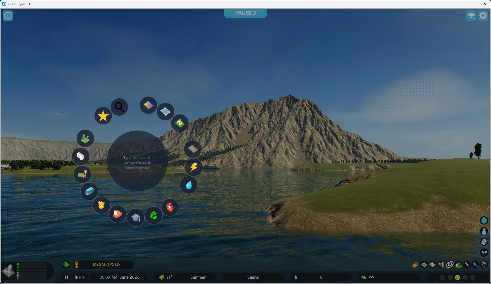
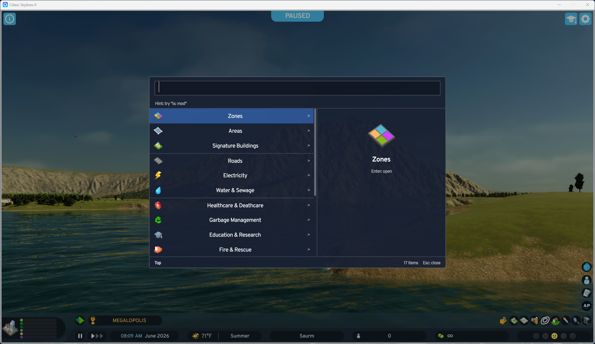

# Better Asset Menu

**Press Tab, type, place.** Search every building, road and prop in Cities:
Skylines II from one menu, with smart filters, per-city favorites and
Find It support.

[Get it on Paradox Mods](https://mods.paradoxplaza.com/mods/161352/Windows) ·
[Report a bug or suggest a feature](https://github.com/bengreenier/csii-mods/issues/new/choose) ·
[Changelog](CHANGELOG.md)

| Radial | Pane |
|---|---|
|  |  |

## Features

- **Just start typing.** Open the menu and type; there's no search box to
  click. Results narrow with every keystroke, and Enter places the match.
- **Filters** find things by what they are, with suggestions as you type.
  Typos in a filter are crossed out and ignored instead of emptying the list.
- **Every theme and pack.** Search covers assets from every theme and asset
  pack, without touching the vanilla theme filter (or limit it to your city's
  theme in settings).
- **Find It support.** With Find It installed, its whole catalogue (props,
  decals, trees, fences, vehicles...) is searchable and browsable from the same
  menu. Find It isn't required.
- **Two menu styles.** *Radial*: a wheel around your cursor or the screen
  center, with a preview in the middle. *Pane*: a keyboard-first list with a
  big preview; click a detail to add it to your search, right-click to exclude
  it. Both search, browse and place the same things.
- **Favorites per city.** Right-click anything to favorite it. Each city keeps
  its own list in its save file.
- **Make it yours.** Rebind the open key or use a mouse button (forward by
  default), scale the menu, hide the vanilla toolbar, stop picks from switching
  on info views, and copy an asset's DLC or mod link.

The mod's settings include a **Usage Guide** tab that walks through every
filter and key with examples.

## Search examples

| Type | To get |
|---|---|
| `fire station` | every fire station |
| `road -highway` | every road except highways |
| `"bus stop"` | that exact phrase |
| `is: ok` | only what you can place right now |
| `is: new` | everything you just unlocked |
| `is: unique -is: placed` | landmarks still waiting for a spot |
| `fx: crime` | anything that affects crime (also `fx: health`, `fx: wellbeing`, `fx: entertainment`) |
| `s: 2x3` | buildings on a lot 2 cells wide and 3 deep |
| `w: 2u road` | roads 2 cells wide |
| `zone: residential zone: high` | high-density housing |
| `theme: european`, `pack:` | a regional style or a content pack |
| `dlc: none`, `is: mod` | base game only, or only mod content |
| `in: parks bench` | search inside a single tab |
| `cat: decals` | a Find It category |

Filters combine: `school is: ok` shows the schools you can build right now.
The full language is specified in [docs/search-schema.md](../docs/search-schema.md).

## Development

### Layout

```
*.cs                 C# side: the UI system and its bindings, settings,
                     favorites, Find It bridge
UI/                  the UI module (React + TypeScript, built with webpack)
  src/mods/menu/     the menu: shell, levels, and the radial and pane views
  test/              Vitest unit and behaviour tests (see test/README.md)
  scripts/           static checks and the post-game-update check
Properties/          Paradox Mods listing: PublishConfiguration.xml, images
```

More in the repository's [docs](../docs/):
[UI architecture](../docs/ui-architecture.md),
[game internals the mod relies on](../docs/game-internals.md),
[search language](../docs/search-schema.md),
[releasing](../docs/releasing.md).

### Building

Requires Windows, Cities: Skylines II with its modding toolchain installed
(it sets `CSII_TOOLPATH`), the .NET SDK and Node.js 18+.

```bash
dotnet build BetterAssetMenu/BetterAssetMenu.csproj
```

This builds the C# project, runs `npm install` (first time) and `npm run build`
in `UI/`, and deploys the mod to the game's local mods folder.

> **Close the game first.** The deploy step deletes the mod folder and fails on
> the locked DLL if the game is running, leaving the mod half-deleted. To
> compile-check C# while the game runs, use
> `dotnet msbuild BetterAssetMenu/BetterAssetMenu.csproj -t:Compile`.

UI-only changes are safe while the game runs: `npm run build` (or
`npm run dev` to watch) in `UI/` writes straight into the deployed mod. Reload
the UI or restart the game to see them.

### Testing

From `UI/`:

| Command | What |
|---|---|
| `npm test` | unit and behaviour tests (Vitest) |
| `npm run typecheck:test` | type-checks the tests |
| `npm run check` | static checks: Gameface CSS, font glyphs, binding names, locale text |
| `npm run check-game` | after a game update: are the game internals the mod uses still there? (needs the game and `ilspycmd`) |

CI runs everything except `check-game` and the C# build, which need the game
installed.

### Releasing

Commit with [Conventional Commits](https://www.conventionalcommits.org/);
release-please opens the release PR. Publishing to Paradox Mods is local. See
[docs/releasing.md](../docs/releasing.md).

## License

Licensed under either of [Apache License, Version 2.0](../LICENSE-APACHE) or
[MIT license](../LICENSE-MIT), at your option.
